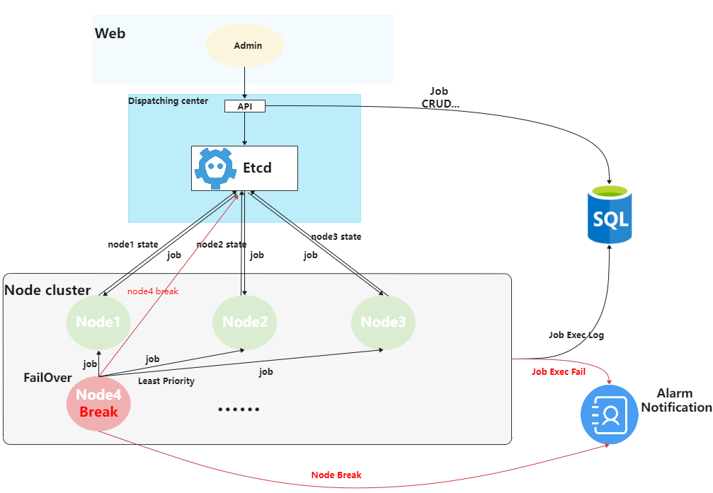

# crony - 分布式定时任务管理平台

<div align=center>


</div>


## 1. 基本介绍

### 1.1 项目背景
项目中存在许多定时任务，很多代码写法都是采取见缝插针式的写法或者直接丢到task服务里面写，存在以下问题 

1. 服务多实例时执行定时任务要考虑抢占锁来争夺定时任务执行权，未抢到锁的任务计算资源被浪费了
2. 定时任务执行情况和执行时间没有统一管理，需要对应开发者结合代码和日志分析情况，带来很高的维护成本，任务没有按时执行，甚至失败了很久才发现，需要重试或排查

### 1.2 项目介绍

> `crony`是一个基于etcd和mysql开发的分布式定时任务集中调度和管理平台，支持多节点部署，支持节点任务自动分配和故障转移，支持任务执行失败告警，部署简单，使用方便。

[在线预览](http://demo.gin-vue-admin.com): http://www.tmnhs.top/

测试用户名：root

测试密码：123456

### 1.3 系统架构图



详情可见  [设计文档](./doc/design.md)
## 2.功能特性

- 支持多节点部署，故障转移
- 支持任务自动分配节点
- Web界面后台管理定时任务，支持多语言
- crontab表达式自动生成
- 任务调度时间粒度支持到`秒`级别
- 任务执行失败可重试
- 用户权限控制
- 支持shell任务和http回调
- 查看任务执行日志
- 任务执行失败告警, 支持邮件、WebHook(提供飞书模板告警)


## 3.使用说明

### 3.1 环境要求

- 安装 [etcd3](https://github.com/coreos/etcd)和[mysql](https://www.mysql.com/)
- golang版本 >= v1.16
- node版本 >= v16.13.0
- yarn

### 3.2 安装部署

- 直接下载二进制可执行文件:[release](https://github.com/tmnhs/crony/releases/tag/v1.2.0)
- 或者可以源码编译:

```bash
#克隆项目
git clone https://github.com/tmnhs/crony.git

#进入项目
cd crony

#编译前需要修改admin(admin/conf/testing/main.json)和node(node/conf/testing.json)的配置文件
#编译，编译后的可执行文件都在bin/目录下
#或者 ./build.sh
make  

#使用脚本运行
#脚本语法：./server.sh {start|stop|restart} {admin|node} {testing|production}
#运行后台，默认使用testing配置文件
./server.sh start admin 
#运行节点
./server.sh start node

```

运行后访问地址:http://localhost:8089

## 4. 技术选型

- 前端： [Vue](https://vuejs.org) + [Element](https://github.com/ElemeFE/element)
- 后端： [Gin](https://gin-gonic.com/) + [Gorm](http://gorm.cn)+ [Viper](https://github.com/spf13/viper)+ [Zap](https://github.com/uber-go/zap)+[Common包](https://github.com/tmnhs/common)
- 定时任务使用：[robfig/cron](https://github.com/robfig/cron)

## 5. 截图

**首页**


**任务列表**


**编辑任务**


**cron表达式生成**


**用户管理**


**日志列表**


**节点管理**


**服务器状态**


**邮件和飞书告警模板**

<div style="height: 250px" align=center>
    
    
</div>

## 6. TODOLIST
- 配置负载均衡器，支持加权轮询和平滑加权轮询（nginx方案）分配任务，(原方案是每次分配给任务数量最少的服务器)
- 定时任务分组


